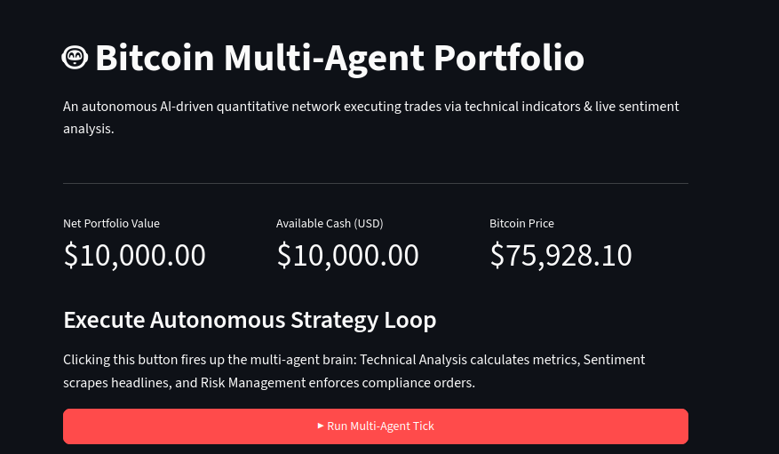
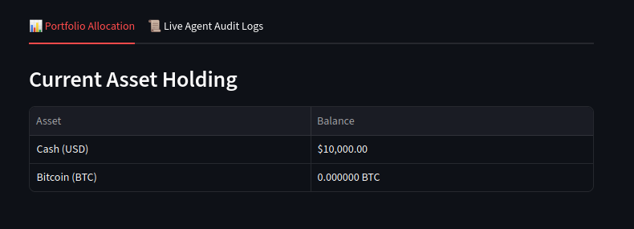
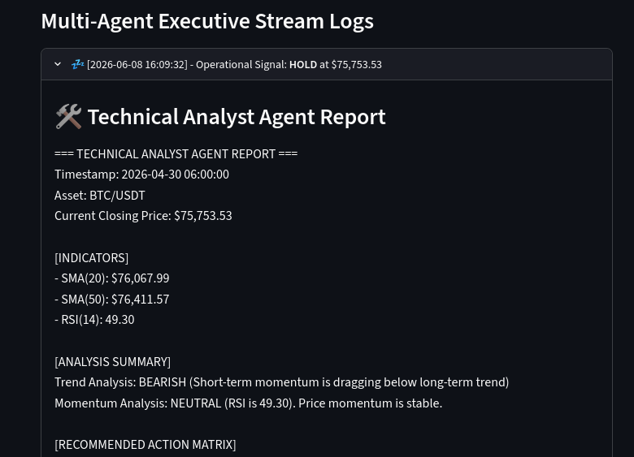
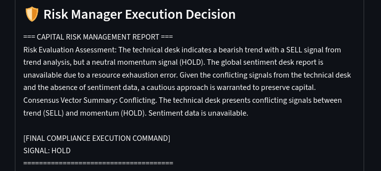
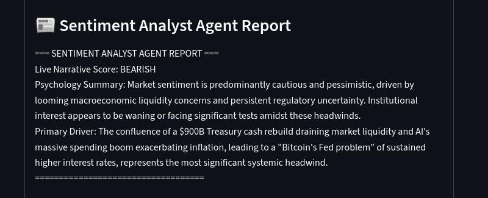

# 🤖 Autonomous Bitcoin Multi-Agent Trading Desk

An enterprise-grade, decoupled multi-agent quantitative framework that simulates algorithmic cryptocurrency allocations. The network combines math-heavy technical analysis with live market psychology sentiment evaluation, feeding into a strict risk management compliance layer that executes paper trades via a persistent database engine.

---

## 🧭 System Architecture

The core framework is built entirely with decoupled separation of concerns, avoiding complex framework dependencies and running completely on free-tier computing tools.

* **Data Layer (`database_layer.py`):** Sources hourly BTC/USDT transaction bands using the `ccxt` library and stores records inside a local SQLite database.
* **Technical Analyst Agent (`technical_agent.py`):** Calculates rolling mathematical statistics (`SMA 20`, `SMA 50`, `RSI 14`) using `pandas` to isolate trend directions.
* **Sentiment Analyst Agent (`sentiment_agent.py`):** Uses `feedparser` to parse live crypto news channels, leveraging Google AI Studio's **Gemini 2.5 Flash** model to score human market sentiment.
* **Risk Manager Agent (`risk_manager_agent.py`):** Acts as the supervisor node. Synthesizes inputs from the Technical and Sentiment agents to make final `BUY`, `SELL`, or `HOLD` determinations based on strict capital preservation boundaries. Features an **automatic failover** mechanism that drops to `gemini-2.5-flash-lite` if the primary model experience global server congestion (`503`).
* **Backtesting Ledger (`backtester.py`):** Simulates a paper wallet initialized with a virtual budget of \$10,000 USD. Updates and records asset balances inside SQLite.
* **Dashboard UI (`app.py`):** A fully responsive, mobile-friendly data interface built with `Streamlit` to visualize current portfolio status, asset metrics, and step-by-step agent transaction audit logs.

---

## 🧭 System Architecture Diagram
```text
Data Layer (ccxt + SQLite)
        ↓
Technical Agent (SMA / RSI)
        ↓
+-----------------------------+
| Sentiment Agent (Gemini AI)|
+-----------------------------+
        ↓
Risk Manager (Decision Engine)
        ↓
Backtesting Ledger (SQLite DB)
        ↓
Streamlit Dashboard
```

## 📊 Key Features

- Multi-agent trading simulation architecture 
- Technical + sentiment hybrid decision engine 
- Risk-managed trade execution system 
- SQLite persistent backtesting ledger 
- Real-time Streamlit visualization dashboard 
- AI failover-safe orchestration layer 

## Screenshots






## 🚀 Installation & Local Deployment

### 1. Clone the Project
```bash
git clone [https://github.com/YOUR_USERNAME/bitcoin-agent-bot.git](https://github.com/YOUR_USERNAME/bitcoin-agent-bot.git)
cd bitcoin-agent-bot
```
2. Set Up a Virtual Environment

On macOS/Linux:

```bash
python3 -m venv venv
source venv/bin/activate
```

On Windows:

```bash
python -m venv venv
venv\Scripts\activate
```

3. Install Dependencies

```bash
pip install -r requirements.txt
```

4. Configure Your Secret Environment Keys

Create a .env file at the root of the project folder:

GEMINI_API_KEY="your_free_google_ai_studio_api_key_here"

5. Initialize Data & Start the Dashboard

```bash
# Pull 60 days of historical data points to seed your technical engines
python src/database_layer.py

# Launch the interactive mobile-friendly web client
streamlit run src/app.py
```
